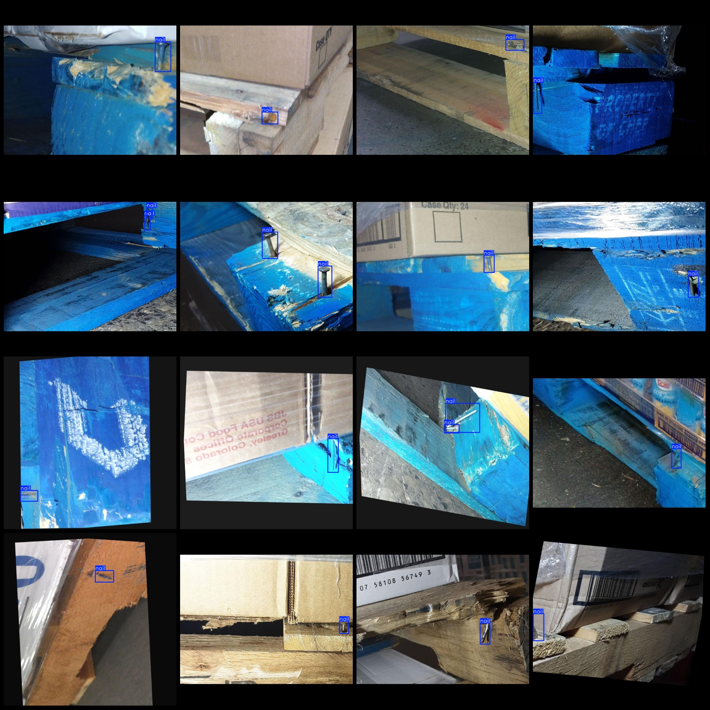
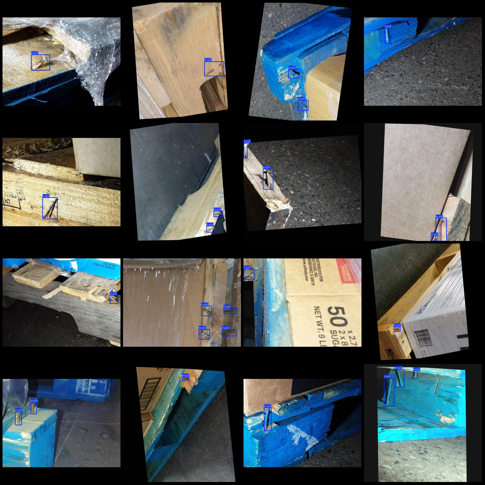

# Venice Dataset with 2812 Images in VOC+YOLO format, 1 Classification

Dataset format: Pascal VOC format+YOLO format (without split path in txtfile, only contain jpgimage and corresponding VOC format xmlfile and yolo format txtfile)
number of images: 2182  
annotation count: 2182  
annotation count: 2182  
annotationnumber of classes: 1  
annotation class names:["nail"]  
boxes per class:   
nail box count = 3184  
total boxes: 3184  
Number of images per category:
nail images = 2182  
image resolution: 640x640  
Use annotation tool: labelImg
Annotation rules: Draw a rectangle around the class.
Important notes: The dataset does not have a division into training, validation, and test sets. You need to divide it yourself.
Special statement: This dataset does not guarantee the accuracy of the trained model or weight file.
Image preview:
## Images

Here is a pay link on Stripe ( https://buy.stripe.com/3cs8yP7sY87d0vu9AB ). Please contact me lonlonago@foxmail.com after funding $89, and I will send you a complete data files , thank you!

